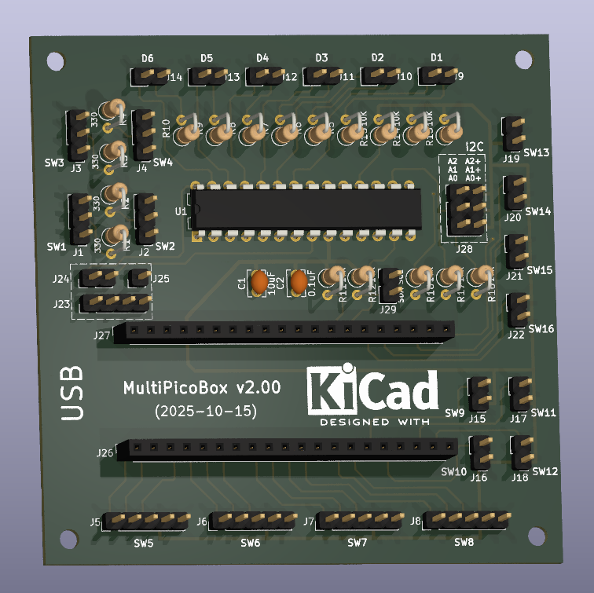

# MultiPicoBox V2

A simple PCB with Raspberry Pi Pico with some buttons and LEDs for gaming.

This new version have :
* 1 GPIO expander with a MCP23017 chip (I2C communication with the Pico,  with jumper configurable address)
* 4 rotary encoders with a push button
* 4 push buttons, 1 temporary position (0/1)
* 4 push buttons, 1 fix position (0-1)
* 4 toggle switches, 3 fixes positions (1-0-2)
* 6 LEDs for warnings/alerts

The schematic and PCB are made with [KiCad](https://www.kicad.org) version 8.

The Raspberry Pi Pico use [CircuitPython](https://circuitpython.org) version 9 with external libraries :

- custom joystick controller [CircuitPython_JoystickXL](https://github.com/fasteddy516/CircuitPython_JoystickXL)

First V2 prototype *8x8cm* (PCB from [AISLER](https://aisler.net) manufacture) :

*Work In Progress :)*

## Documentation :

ALPS EC11 rotary encoders :
* https://tech.alpsalpine.com/e/products/category/encorders/sub/01/series/ec11e/

Bus I2C :
* https://www.i2c-bus.org
* https://learn.adafruit.com/working-with-i2c-devices?view=all
* https://learn.sparkfun.com/tutorials/i2c/i2c-at-the-hardware-level
	

Microchip GPIO expander MCP23017 :
* https://www.microchip.com/en-us/product/mcp23017

## Bill Of Materials (BOM) :

| Reference  | Qty | Value | Footprint | Description |
| ------------- | ------------- | ------------- | ------------- | ------------- |
| C1|1|10uF|Capacitor_THT:C_Disc_D3.8mm_W2.6mm_P2.50mm|Unpolarized capacitor, small symbol |
| C2|1|0.1uF|Capacitor_THT:C_Disc_D3.8mm_W2.6mm_P2.50mm|Unpolarized capacitor, small symbol |
| D1,D2,D3,D4,D5,D6|6|LED||Light emitting diode |
| J1,J2,J3,J4|4|Conn_01x03_Pin|Connector_PinHeader_2.54mm:PinHeader_1x03_P2.54mm_Vertical|Generic connector, single row, 01x03, script generated |
| J5,J6,J7,J8|4|Conn_01x05_Pin|Connector_PinHeader_2.54mm:PinHeader_1x05_P2.54mm_Vertical|Generic connector, single row, 01x05, script generated |
| J9,J10,J11,J12,J13,J14,J15,J16,J17,J18,J19,J20,J21,J22|14|Conn_01x02_Pin|Connector_PinHeader_2.54mm:PinHeader_1x02_P2.54mm_Vertical|Generic connector, single row, 01x02, script generated |
| J26,J27|2|Conn_01x20_Socket|Connector_PinSocket_2.54mm:PinSocket_1x20_P2.54mm_Vertical| |
| J28|1|Conn_02x03_Top_Bottom|MuliPicoBox_V2:PinHeader_2x03_P2.54mm_Vertical_Re-Order-Pins|Generic connector, double row, 02x03, top/bottom pin numbering scheme (row 1: 1...pins_per_row, row2: pins_per_row+1 ... num_pins), script generated (kicad-library-utils/schlib/autogen/connector/) |
| R1,R2,R3,R4|4|330|Resistor_THT:R_Axial_DIN0207_L6.3mm_D2.5mm_P2.54mm_Vertical| |
| R5,R6,R7,R8,R9,R10|6|270|Resistor_THT:R_Axial_DIN0207_L6.3mm_D2.5mm_P2.54mm_Vertical| |
| R11,R12,R13,R14,R15,R16,R17,R18|8|10K|Resistor_THT:R_Axial_DIN0207_L6.3mm_D2.5mm_P2.54mm_Vertical| |
| SW1,SW2,SW3,SW4|4|SW_SPDT_MSM||Switch, single pole double throw, center OFF position |
| SW5,SW6,SW7,SW8|4|RotaryEncoder_Switch||Rotary encoder, dual channel, incremental quadrate outputs, with switch |
| SW9,SW10,SW11,SW12|4|SW_Push||Push button switch, generic, two pins |
| SW13,SW14,SW15,SW16|4|SW_SPST||Single Pole Single Throw (SPST) switch |
| U1|1|MCP23017_I2C|Package_DIP:DIP-28_W7.62mm|16-bit I/O expander, I2C, interrupts, w pull-ups, SPDIP-28 |

Happy coding & have fun ! :partying_face: