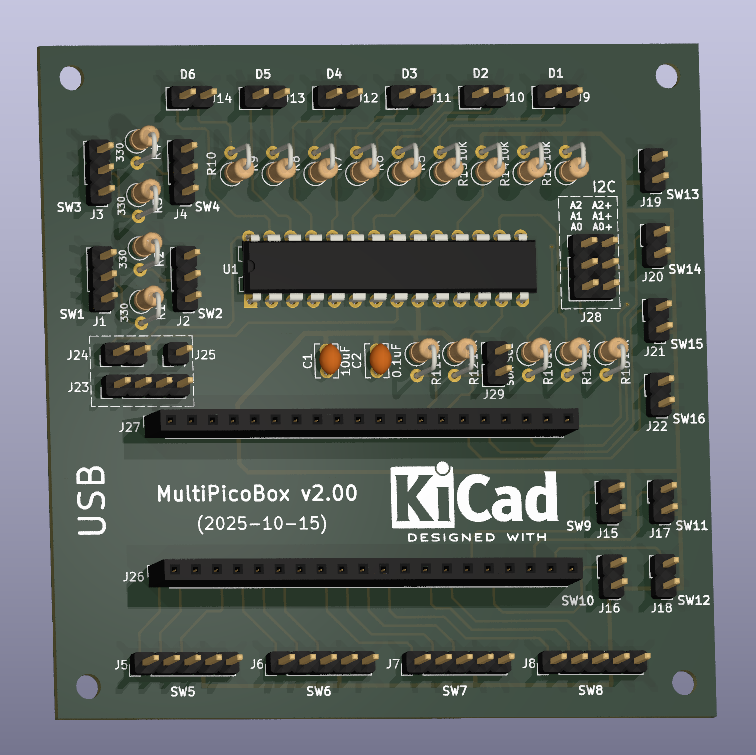
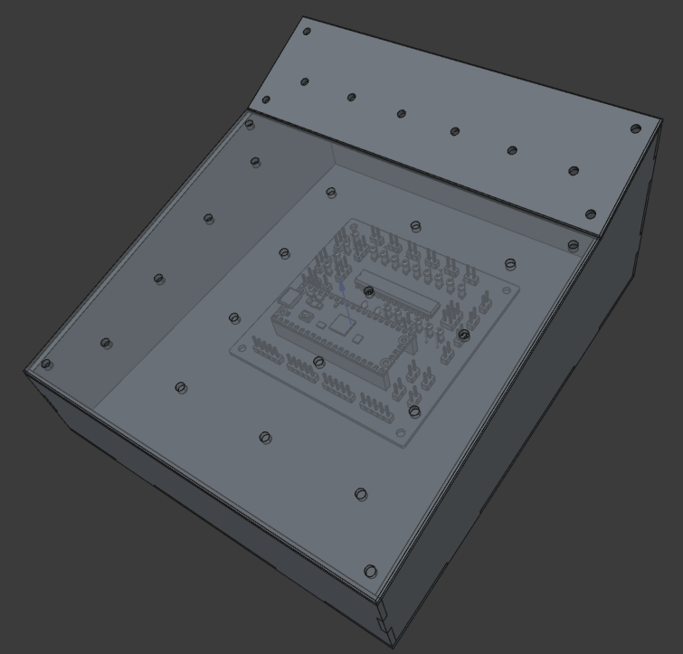

# MultiPicoBox V2

A simple PCB with a Raspberry Pi Pico and some buttons, LEDs for gaming.

This new version have :
* 1 GPIO expander with a MCP23017 chip (**I2C communication with the Pico**,  with configurable jumpers address)
* 4 rotary encoders with a push button
* 4 push buttons, 1 temporary position (0/1)
* 4 push buttons, 1 fix position (0-1)
* 4 toggle switches, 3 fixes positions (1-0-2)
* 6 LEDs for warnings/alerts

This Raspberry Pi Pico use [CircuitPython](https://circuitpython.org) version 9.x with external libraries :
- Adafruit module [CircuitPython_MCP230xx](https://github.com/adafruit/Adafruit_CircuitPython_MCP230xx)

- Joystick module [CircuitPython_JoystickXL](https://github.com/fasteddy516/CircuitPython_JoystickXL)

## Printed Circuit Board (PCB) :

The schematic and PCB are made with [KiCad](https://www.kicad.org) version 8 ([kicad](https://github.com/Mick3DIY/MultiPicoBox/tree/main/kicad) folder).

First V2 prototype (8 x 8 cm only) from [AISLER](https://aisler.net) manufacturer :

Some useful plugins for KiCad :
* AISLER Push for KiCad : https://github.com/aislerhq
* Interactive HTML BOM : https://github.com/openscopeproject/InteractiveHtmlBom
* Board2Pdf : https://gitlab.com/dennevi/Board2Pdf
* Solarized Dark Theme : https://github.com/pointhi/kicad-color-schemes

Many thanks to [@Kochise](https://github.com/kochise) for his help and tips for the PCB :beers:

## 3D Enclosure :

The first enclosure prototype made with [FreeCad](https://www.freecad.org) version 1.0.x. *Work is progress !*

## Code :

* **MultiPicoBoxV2_PCB_test** is for testing the PCB with all external components

* **MultiPicoBoxV2_JoystickXL_test** is for testing everything like a gamepad :joystick:

Look at the [code](https://github.com/Mick3DIY/MultiPicoBox/tree/main/code) folder for more details.

## Documentation :

Bus I2C :
* https://www.i2c-bus.org
* https://learn.adafruit.com/working-with-i2c-devices?view=all :ok_hand:
* https://learn.adafruit.com/circuitpython-basics-i2c-and-spi?view=all
* https://learn.sparkfun.com/tutorials/i2c/i2c-at-the-hardware-level

Microchip GPIO expander MCP23017 :
* https://www.microchip.com/en-us/product/mcp23017
* https://learn.adafruit.com/using-mcp23008-mcp23017-with-circuitpython?view=all :ok_hand:
* https://www.woolseyworkshop.com/2021/03/18/adding-digital-io-to-your-arduino-part-3-the-mcp23017/

Rotary encoders :
* https://learn.adafruit.com/rotary-encoder?view=all
* https://howtomechatronics.com/tutorials/arduino/rotary-encoder-works-use-arduino/
* Alps EC11E series : https://tech.alpsalpine.com/e/products/category/encorders/sub/01/series/ec11e/
* Bourns PEC11R series : https://www.bourns.com/products/encoders/contacting-encoders

## Bill Of Materials (BOM) :

The BOM and an interactive BOM (HTML version) for components assembly are in the [kicad](https://github.com/Mick3DIY/MultiPicoBox/tree/main/kicad) folder.

> [!NOTE]
> Big thanks to the [Adafruit](https://www.adafruit.com) company, to all [Python](https://www.python.org/), [MicroPython](https://micropython.org), [CircuitPython](https://circuitpython.org) communities. :heart: 
> 
>Happy coding & have fun ! :partying_face:
