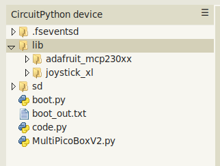
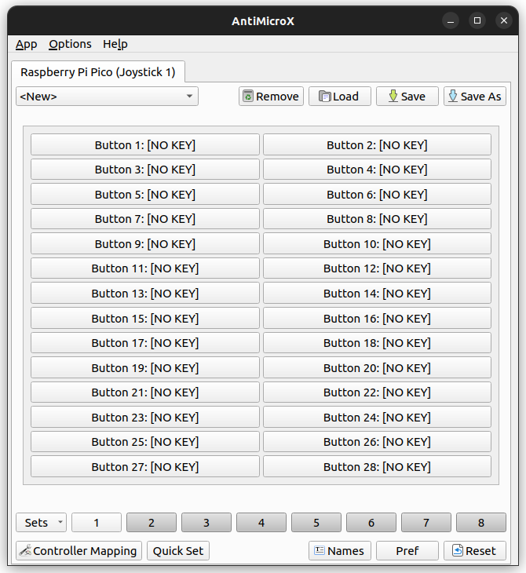

## Code :

* **MultiPicoBoxV2_PCB_test** is for testing the PCB with all external components
	- Requirements : [CircuitPython](https://circuitpython.org), [Adafruit_CircuitPython_MCP230xx](https://github.com/adafruit/Adafruit_CircuitPython_MCP230xx), [CircuitPython BusDevice](https://github.com/adafruit/Adafruit_CircuitPython_BusDevice) for I2C communication (already builtin with CircuitPython version 9)
	- Imports from `MultiPicoBoxV2_PCB_test.py` :

```python
# MultiPicoBoxV2 PCB test code in CircuitPython (V9)
# GitHub project : https://github.com/Mick3DIY/MultiPicoBox
# Raspberry Pi Pico : https://www.raspberrypi.com/products/raspberry-pi-pico/
# Documentation, tutorials : https://projects.raspberrypi.org
# CircuitPython : https://learn.adafruit.com/welcome-to-circuitpython
# Thonny IDE : https://thonny.org
import board
import busio
# https://docs.circuitpython.org/en/latest/shared-bindings/digitalio/index.html
from digitalio import DigitalInOut, Direction, Pull
# https://docs.circuitpython.org/en/latest/shared-bindings/rotaryio/index.html
import rotaryio
# https://docs.circuitpython.org/projects/mcp230xx/en/latest/
from adafruit_mcp230xx.mcp23017 import MCP23017
from time import sleep
```

* **MultiPicoBoxV2_JoystickXL_test** is for testing everything like a gamepad :joystick:
	- Requirements :  [CircuitPython](https://circuitpython.org), [Adafruit_CircuitPython_MCP230xx](https://github.com/adafruit/Adafruit_CircuitPython_MCP230xx), [CircuitPython BusDevice](https://github.com/adafruit/Adafruit_CircuitPython_BusDevice) for I2C communication (already builtin with CircuitPython version 9), [CircuitPython_JoystickXL](https://github.com/fasteddy516/CircuitPython_JoystickXL)
	- Read carefully these chapters from JoystickXL documentation : requirements, limitations, host OS/Software compatibilities in https://circuitpython-joystickxl.readthedocs.io/en/latest/
	- After verifying compatibilities copy the file `boot.py` in the Pico board.
	**Don't forget to reboot the Raspberry Pi Pico after create or update this file !**
	- Then create a new file `code.py` in the Pico board with Thonny IDE and the code from `MultiPicoBoxV2_JoystickXL_test.py`.
	- Imports from `MultiPicoBoxV2_JoystickXL_test.py` :

```python
# MultiPicoBoxV2 JoystickXL test code in CircuitPython (V9)
# GitHub project : https://github.com/Mick3DIY/MultiPicoBox
# Raspberry Pi Pico : https://www.raspberrypi.com/products/raspberry-pi-pico/
# Documentation, tutorials : https://projects.raspberrypi.org
# CircuitPython : https://learn.adafruit.com/welcome-to-circuitpython
# Thonny IDE : https://thonny.org
import board
# https://docs.circuitpython.org/en/latest/shared-bindings/busio/
import busio
# https://docs.circuitpython.org/en/latest/shared-bindings/digitalio/index.html
from digitalio import DigitalInOut, Direction, Pull
# https://docs.circuitpython.org/en/latest/shared-bindings/rotaryio/index.html
import rotaryio
# https://docs.circuitpython.org/projects/mcp230xx/en/latest/
from adafruit_mcp230xx.mcp23017 import MCP23017
# https://circuitpython-joystickxl.readthedocs.io/en/latest/api.html#module-joystick_xl.inputs
from joystick_xl.inputs import Button
# https://circuitpython-joystickxl.readthedocs.io/en/latest/api.html#module-joystick_xl.joystick
from joystick_xl.joystick import Joystick
from time import sleep
```

Finally, you will have these files and folders structure :



Useful software for testing this code in action (Windows, Linux) :space_invader:
* AntiMicroX : https://github.com/AntiMicroX/antimicrox



Happy coding & have fun ! :partying_face: