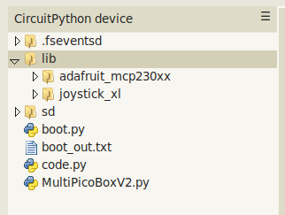
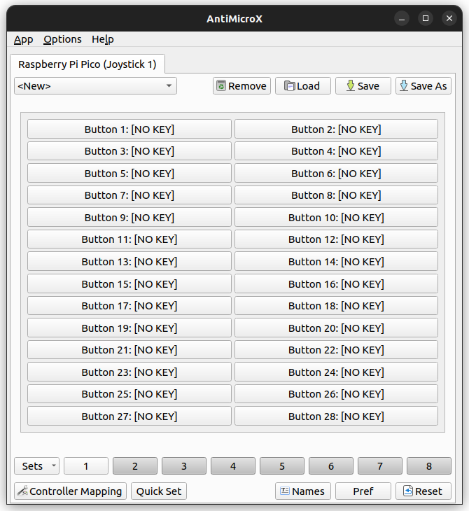

## Code (MultiPicoBoxV2_PCB_test) :

* MultiPicoBoxV2_PCB_test is for **testing the PCB** with all external components
	- Requirements : [CircuitPython](https://circuitpython.org), [Adafruit_CircuitPython_MCP230xx](https://github.com/adafruit/Adafruit_CircuitPython_MCP230xx), [CircuitPython BusDevice](https://github.com/adafruit/Adafruit_CircuitPython_BusDevice) for I2C communication (already builtin with CircuitPython version 9), MultiPicoBoxV2 class.

## Code (MultiPicoBoxV2_JoystickXL_test) :

* MultiPicoBoxV2_JoystickXL_test is for **testing everything like a gamepad** :joystick:
	- Requirements :  [CircuitPython](https://circuitpython.org), [Adafruit_CircuitPython_MCP230xx](https://github.com/adafruit/Adafruit_CircuitPython_MCP230xx), [CircuitPython BusDevice](https://github.com/adafruit/Adafruit_CircuitPython_BusDevice) for I2C communication (already builtin with CircuitPython version 9), [CircuitPython_JoystickXL](https://github.com/fasteddy516/CircuitPython_JoystickXL), MultiPicoBoxV2 class
	- Read carefully these chapters from JoystickXL documentation : requirements, limitations, host OS/Software compatibilities in https://circuitpython-joystickxl.readthedocs.io/en/latest/
	- After verifying compatibility copy the file `boot.py` in the Pico board.
	**Don't forget to reboot the Raspberry Pi Pico after create or update this file !**
	- Then create a new file `code.py` in the Pico board with Thonny IDE and the code from `MultiPicoBoxV2_JoystickXL_test.py`
	- Copy the main class file `MultiPicoBoxV2.py` in the Pico board root.

Finally, you will have these files and folders structure :

Useful software for testing this code in action (Windows, Linux) :space_invader:
* AntiMicroX : https://github.com/AntiMicroX/antimicrox

Happy coding & have fun ! :partying_face: