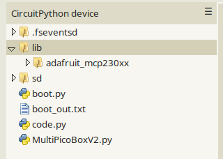
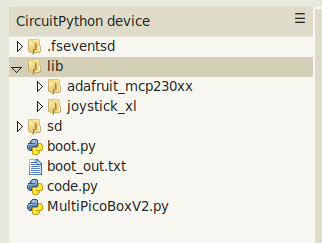
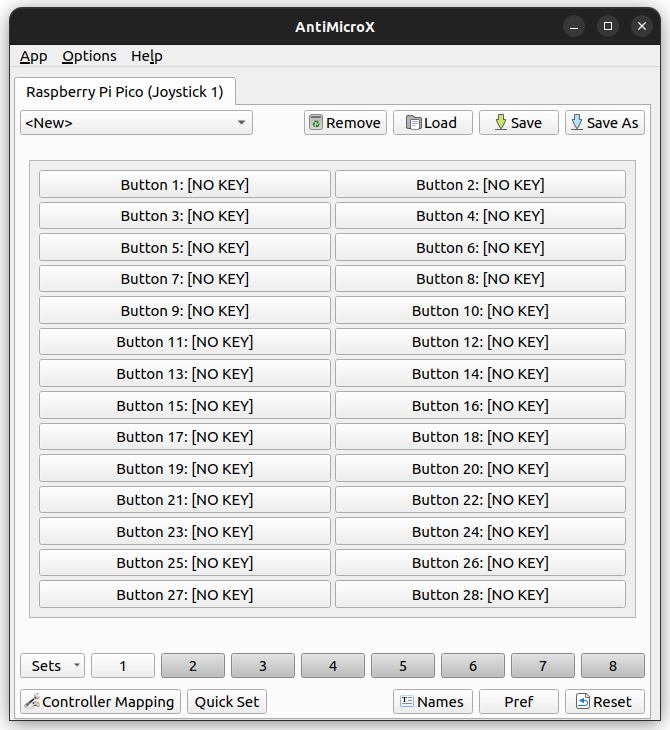

## Common code (*_PCB_test, *_JoystickXL_test)

> [!TIP]
> If you don't see the CIRCUITPY drive in your file manager (after installing one of the code section below) :
> - **Press and hold** the push button SW9 (J15), **power ON** the Pico to expose its drive for editing.

You can also disable this default functionality by commenting the last `if-else` test in the boot code file from `boot_PCB_test.py` or `boot_JoystickXL_test.py`.

## Code (MultiPicoBoxV2_PCB_test) :

* MultiPicoBoxV2_PCB_test is for **testing the PCB** with all external components
	- Requirements : [CircuitPython](https://circuitpython.org), [Adafruit_CircuitPython_MCP230xx](https://github.com/adafruit/Adafruit_CircuitPython_MCP230xx), [CircuitPython BusDevice](https://github.com/adafruit/Adafruit_CircuitPython_BusDevice) for I2C communication (already builtin with CircuitPython version 9), MultiPicoBoxV2 class
	- Create a new file `boot.py` in the Pico board with Thonny IDE and the code from `boot_PCB_test.py`
	- Then create a new file `code.py` in the Pico board and the code from `MultiPicoBoxV2_PCB_test.py`
	- Copy the main class file `MultiPicoBoxV2.py` in the Pico board root folder
	- Open and run the file `code.py` in Thonny IDE and check the shell terminal with all buttons.

Files and folders structure from this part :

## Code (MultiPicoBoxV2_JoystickXL_test) :

* MultiPicoBoxV2_JoystickXL_test is for **testing everything like a gamepad** :joystick:
	- Requirements :  [CircuitPython](https://circuitpython.org), [Adafruit_CircuitPython_MCP230xx](https://github.com/adafruit/Adafruit_CircuitPython_MCP230xx), [CircuitPython BusDevice](https://github.com/adafruit/Adafruit_CircuitPython_BusDevice) for I2C communication (already builtin with CircuitPython version 9), [CircuitPython_JoystickXL](https://github.com/fasteddy516/CircuitPython_JoystickXL), MultiPicoBoxV2 class
	- Read carefully these chapters from JoystickXL documentation : requirements, limitations, host OS/Software compatibilities in https://circuitpython-joystickxl.readthedocs.io/en/latest/
	- Create a new file `boot.py` in the Pico board and the code from `boot_JoystickXL_test.py`
	- Then create a new file `code.py` in the Pico board and the code from `MultiPicoBoxV2_JoystickXL_test.py`
	- Copy the main class file `MultiPicoBoxV2.py` in the Pico board root folder
	- Open and run the file `code.py` in Thonny IDE and check the shell terminal with all buttons or/and with AntiMicroX software below.

**Don't forget to reboot the Raspberry Pi Pico after create or update the `boot.py` file !**

Files and folders structure from this second part :

Useful software for testing this code in action (Windows, Linux) :space_invader:
* AntiMicroX : https://github.com/AntiMicroX/antimicrox

Happy coding & have fun ! :partying_face: