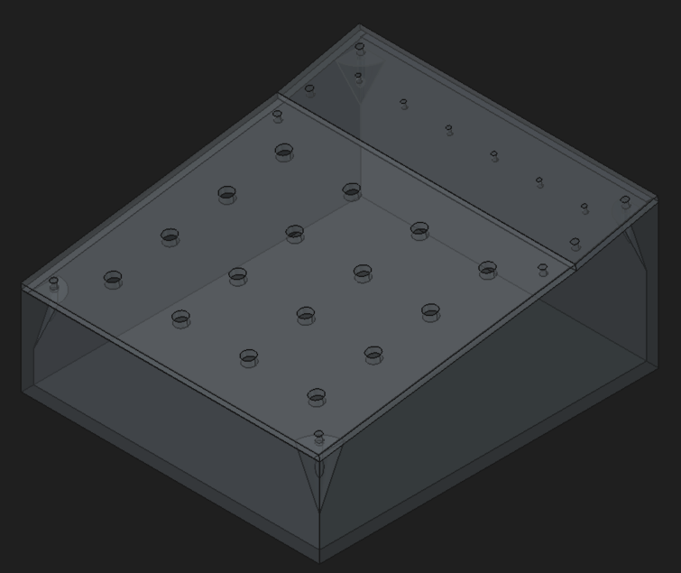

## 3D Enclosure (Work is progress) :

This first enclosure prototype is in seven parts (all in the compressed file) :

| Original document | Comment |
| --------- | --------- |
| 00_Assemblage.FCStd | General 3D view assembly |
| 01_Fond.FCStd | Bottom part |
| 02_Face-AV.FCStd | Front face part |
| 03_Face-AR.FCStd | Rear face part |
| 04_Faces-GD.FCStd | Left and right face part |
| 05_Face-Pupitre.FCStd | Buttons face part |
| 06_Face-Affichage.FCStd | LEDs face part |
| Dimensions.FCStd | All parametric values in mm |

You can print all these parts from the PDF files in this folder.

If you have a 3D printer, you can print all the three parts (see the **3DPrint** compressed file with STL format) :

| Original document | Comment |
| --------- | --------- |
| 00_MultiPicoBox_Assembly.FCStd | General 3D view assembly |
| 01_MultiPicoBox_Main_panel.FCStd | Main panel in one part |
| 02_MultiPicoBox_Buttons_panel.FCStd | Buttons face part |
| 03_MultiPicoBox_LEDs_panel.FCStd | LEDs face part |

All measurements are in 'VarSet' section on each files so don't forget to adjust drills diameter (buttons, LEDs...), add some filets for a perfect finish !

> [!NOTE]
> Big thanks to the [FreeCad](https://www.freecad.org) and plugins communities. :heart:

Happy crafting & have fun ! :partying_face: