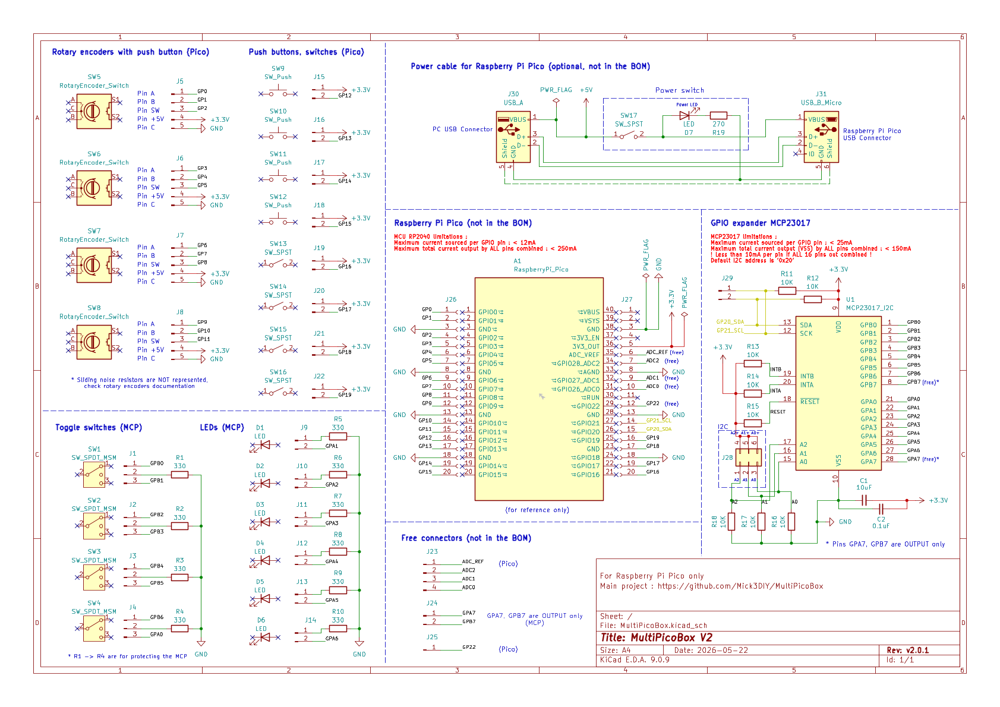

## Schematic :

### Table for I2C addresses (default is '0x20') :

| Addresses | A0 | A1 | A2 | Addresses | A0 | A1 | A2 |
| :---: | :---: | :---: | :---: | :---: | :---: | :---: | :---: | 
| 0x20 | 0 | 0 | 0 | 0x24 | 0 | 0 | 1 |
| 0x21 | 1 | 0 | 0 | 0x25 | 1 | 0 | 1 |
| 0x22 | 0 | 1 | 0 | 0x26 | 0 | 1 | 1 |
| 0x23 | 1 | 1 | 0 | 0x27 | 1 | 1 | 1 |

## Interactive Bill Of Materials (BOM) :

An HTML version of the BOM is in the [bom](https://htmlpreview.github.io/?https://github.com/Mick3DIY/MultiPicoBox/blob/main/kicad/bom/MultiPicoBoxV2_ibom.html) folder (from the KiCad plugin [Interactive HTML BOM](https://github.com/openscopeproject/InteractiveHtmlBom))

Happy soldering & have fun ! :partying_face: